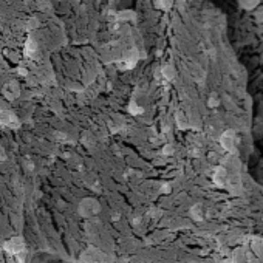
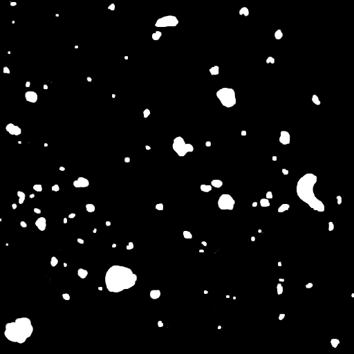
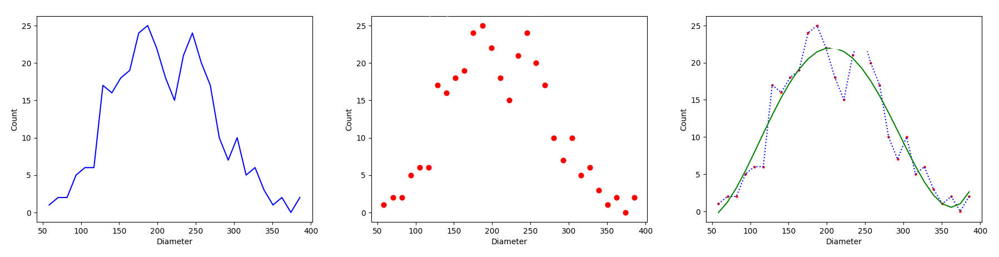

# SEM Morphological Analysis Dataset

## Project Description

This repository contains the implementation of a deep learning-based pipeline for analyzing the morphology of particles in scanning electron microscopy (SEM) images. The pipeline facilitates segmentation of nanoparticles, extraction of particle statistics (such as area and diameter), and quantification of dispersion metrics. The system integrates convolutional neural networks with custom image processing and analysis tools to support scientific investigation of polymer nanocomposites and their interfacial properties.

<br>
<table>
  <tr>
    <td></td>
    <td></td>
  </tr>
</table>

---

## Dataset

### Dataset Directory

The dataset consists of annotated SEM micrographs for training and evaluation. These images were used for morphological segmentation and statistical analysis of nanocomposite fillers. The dataset is not publicly available. It is intended solely for academic research.

```plaintext
Dataset/
├── SEM/
│   ├── image1.png
│   ├── image2.png
│   └── ...
└── Segmented/
    ├── image1.png
    ├── image2.png
    └── ...
```


To access the dataset, please contact:
**amirhossein.najafi.cs@gmail.com**

In your request, include a short description of your research and your institutional affiliation. The dataset will be shared for non-commercial scientific purposes only.

---

## Training the Model

The model training is handled using PyTorch and supports various deep learning architectures for image segmentation. The training script provided supports U-Net and other backbones.

**Script**: `train_segmentation_model.py`

Usage:
```bash
python train_segmentation_model.py --dataset_dir ./Dataset --model unet --epochs 100 --lr 0.0001
```

You can modify the architecture or hyperparameters as needed. The dataset directory must be structured with input images and corresponding masks.

---

## Measuring Particle Area and Diameter

After segmentation, particle measurements can be extracted using the following script:

**Script**: `particle_stats.py`

This script calculates the particle area or diameter from a binary mask and saves the results to a CSV file.

Usage:
```bash
python particle_stats.py --input Detected-Maski.png --output output.csv --measure Diameter
```

This produces statistics including:
- Number of particles
- Mean, max, and min diameter or area
- Total particle coverage

---

## Visualizing the Distribution

To visualize the distribution of area or diameter from the CSV output:

**Script**: `plot_distribution_from_csv.py`

Usage:
```bash
python plot_distribution_from_csv.py -c output.csv
```

This script plots a histogram showing the distribution of particle sizes.



---

## Calculating Dispersion Metrics

To assess particle dispersion quantitatively, the following indices are calculated:

- **Scattering Index**: Measures how uniformly particles are spatially distributed.
- **Non-Adhesion Index**: Indicates the clustering or aggregation behavior of particles.

**Script**: `calculate_dispersion_indices.py`

Usage:
```bash
python calculate_dispersion_indices.py -c output.csv
```

This reads the particle data and returns numeric values for both indices.

---

## Script Summary

| Purpose                             | Script Name                        |
|------------------------------------|------------------------------------|
| Train segmentation model           | `train_segmentation_model.py`      |
| Extract area/diameter stats        | `particle_stats.py`                |
| Plot particle distribution         | `plot_distribution_from_csv.py`    |
| Compute dispersion indices         | `calculate_dispersion_indices.py`  |

---

## Citation

If you use this repository or its dataset/scripts in your research, please cite the following works:

1. Mohsenzadeh, R., Soudmand, B. H., Najafi, A. H., Hazzazi, F., & Fattahi, M. (2024). *Deep learning-assisted morphological segmentation for effective particle area estimation and prediction of interfacial properties in polymer composites*. **Nanoscale**, 16(45), 21155–21173. https://doi.org/10.1039/D4NR01018C

2. Mohsenzadeh, R., Soudmand, B. H., Najafi, A. H., & Hazzazi, F. (2024). *Morphology-driven nanofiller size measurement integrated with micromechanical finite element analysis for quantifying interphase in polymer nanocomposites*. **ACS Applied Materials & Interfaces**, 16(30), 39927–39941. https://doi.org/10.1021/acsami.4c02797

3. Mohsenzadeh, R., Soudmand, B., Najafi, A., Fattahi, M., & Uyen, D. (2024). *Analysis of interfacial characteristics in polymer nanocomposites via visual particle recognition methodology and micromechanical predictive models*. **Composites Science and Technology**, 245, 110360. https://doi.org/10.1016/j.compscitech.2023.110360
